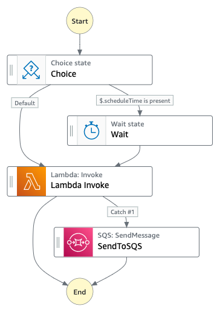

# Step Function for scheduled HTTP execution

## NOT SUITABLE FOR PRODUCTION, LEARNING PURPOSE ONLY

_This project is licensed under the terms of the MIT license._

Example of using step function to orchestrate execution of HTTP endpoint. Features:

1. Scheduled execution
2. Retry with backoff strategy, and dead-letter queue to hold failed execution data

### Setup

1. Prepare an SQS queue. We will use this as dead-letter queue after retry attempts failed
2. Create Lambda that will trigger HTTP endpoint execution. Sample Python code provided in `lambda_function.py`. Note: you will need `requests` package, you can ship it together with the code or package it as Lambda Layers. Also make sure the Lambda has required network connectivity to HTTP URL that you want to trigger
3. Create the Step Function with the provided JSON definition, make sure to change Lambda ARN and SQS URL with your own. Make sure the Step Function IAM Role has permission for `lambda:InvokeFunction` and `sqs:SendMessage`

### Run the example

Sample Go code to run the Step Function is provided. Setup environment variable `STEP_FUNCTION_ARN` with ARN of your step function, and run:

`go run main.go`

Tested in AWS region ap-southeast-3.